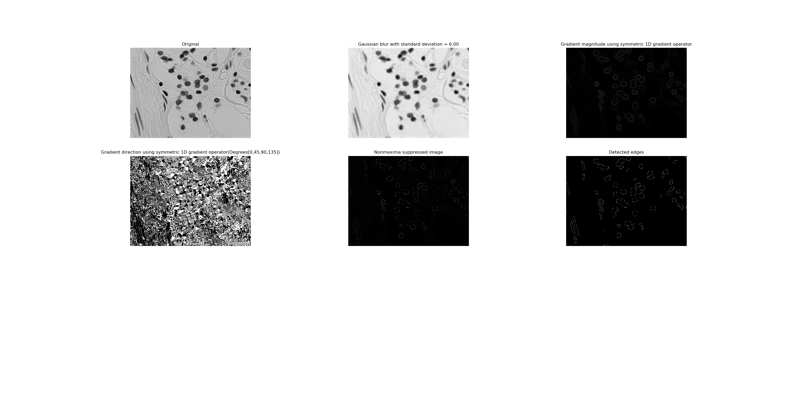
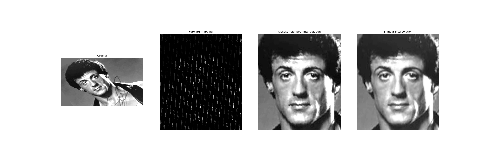
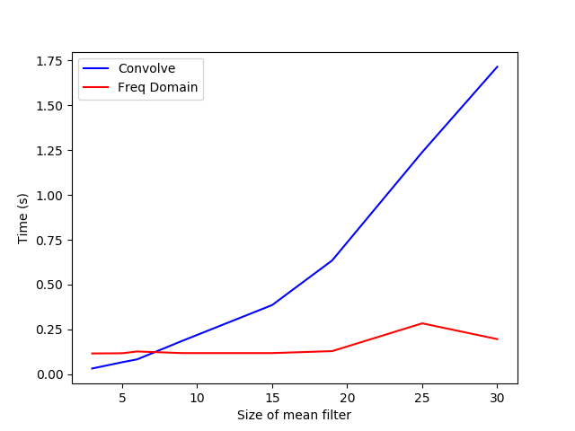
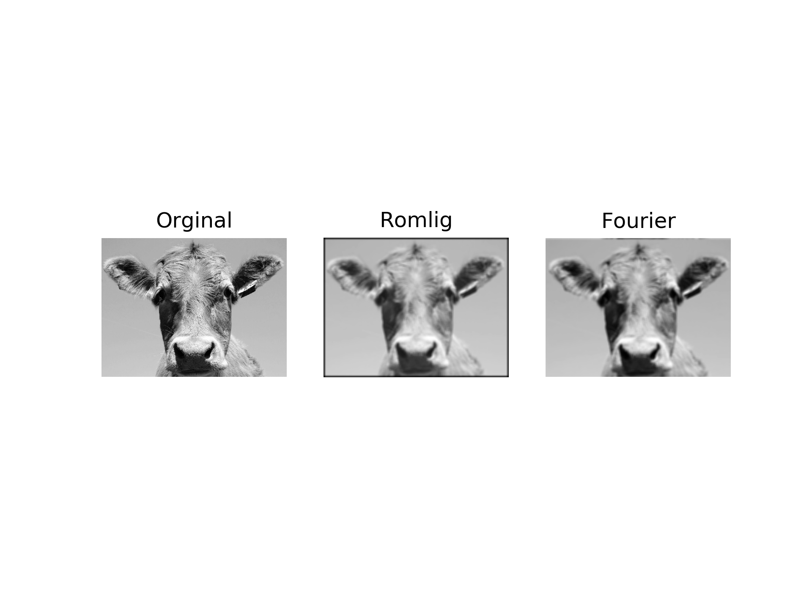

# Digital Image Processing
Algorithms related to digital image processing implemented for educational purpose in coherence with course [INF2310](https://www.uio.no/studier/emner/matnat/ifi/INF2310/).

## Implemented Algorithms/Solutions
### Canny Edge Detector [:white_check_mark:](canny_edge_detection/)
Crude implementation of the Canny Edge Detector in order to outline cells from a microscope image.

### Preprocessing for facial recognition [:white_check_mark:](preprocessing_for_facial_recognition/)
Some simple preprocessing for facial recognition such as standardising contrast and image transformation.

### Implementation of convolution filters in the frequency domain [:white_check_mark:](convolution_in_frequency_domain/)
A comparison of speed between convolution filters in space and frequency domain.

### Lossy JPEG compression [:white_check_mark:](lossy_jpeg_compression/)
An implementation of a lossy JPEG compression algorithm.

